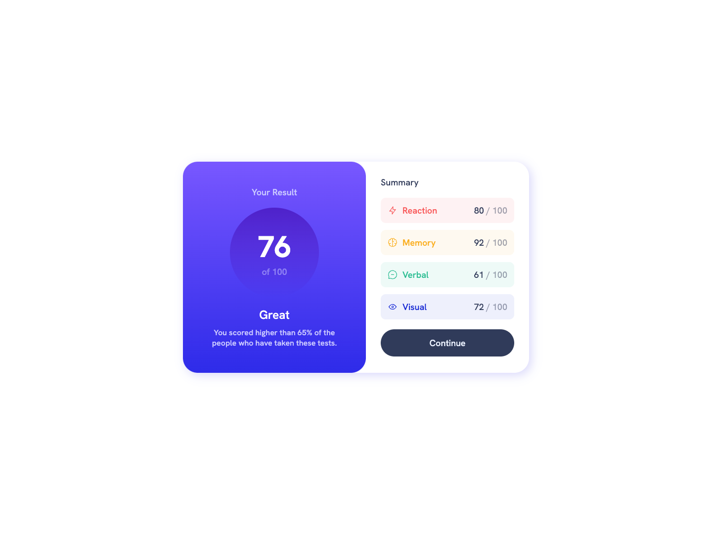
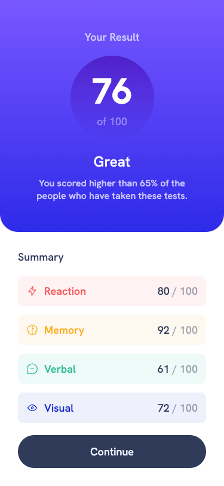

# Frontend Mentor - Results summary component solution

### Design Preview

This is a solution to the [Results summary component challenge on Frontend Mentor](https://www.frontendmentor.io/challenges/results-summary-component-CE_K6s0maV). Frontend Mentor challenges help you improve your coding skills by building realistic projects. 

## Table of contents

- [Overview](#overview)
  - [The challenge](#the-challenge)
  - [Screenshot](#screenshot)
  - [Links](#links)
- [My process](#my-process)
  - [Built with](#built-with)

## Overview

### The challenge

- Build out the project to the designs provided

### Screenshot

### Links

- Solution URL: [https://github.com/sjneri/results-summary](https://github.com/sjneri/results-summary)
- Live Site URL: [https://sjneri.github.io/results-summary/](https://sjneri.github.io/results-summary/)

## My process

### Built with

- Semantic HTML5 markup
- CSS custom properties / Sass
- Flexbox
- JSON